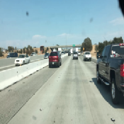
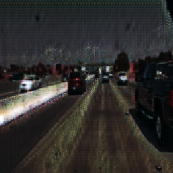

# Day-to-Night Translation using CycleGAN

**Report:** [UnpairedDayToNight.pdf](docs/UnpairedDayToNight.pdf)  
**Colab Notebook:** [Open in Colab](https://colab.research.google.com/github/tarungangadhar/day-to-night-cycleGAN/blob/main/code/UnpairedDayToNight.ipynb)  
**Project Website:** [View Website](https://tarungangadhar.github.io/day-to-night-cycleGAN/)

---

## 📌 Abstract
This project explores **unpaired image-to-image translation** for converting **daytime driving scenes into nighttime equivalents** using **CycleGAN**. Unlike paired supervised methods, CycleGAN leverages cycle-consistency and adversarial training to learn mappings between **Day ↔ Night** domains without requiring aligned image pairs.  
The goal is to enhance datasets for autonomous driving research where night data is limited.

---

## 🛠 Method

- **Architecture:** CycleGAN (two generators + two discriminators)
- **Adversarial Objective:** Least-Squares GAN (LSGAN) loss
- **Cycle Consistency:** Enforces forward–backward consistency (`Day → Night → Day`)
- **Identity Loss:** Encourages generators to preserve color mapping when given images from the target domain
- **Dataset:** BDD100K (10k subset). Day/Night domain split was generated using **luminance-based heuristics**.
- **Implementation:** PyTorch, trained with Adam optimizer (`lr=0.0002`)

  

---

## 📊 Results

### Quantitative Performance
- **Day → Night (A→B):**  
  - SSIM: **0.80 – 0.86**  
  - PSNR: **~25 dB**  
  - LPIPS: **0.18 – 0.22**

- **Night → Day (B→A):**  
  - SSIM: **~0.82 avg**  
  - PSNR: **mid-20 dB range**  
  - LPIPS: **~0.18 – 0.22**

**Trends:**  
- SSIM increased steadily into the low–mid 0.8s  
- PSNR stabilized in the mid-20s  
- LPIPS dropped to ≈ **0.18–0.19** by the last epoch

### Qualitative Samples

| Input (Day) | Generated (Night) | Cycle Reconstructed (Day) |
|-------------|-------------------|---------------------------|
|  |  |  |

### Comparison Grid

  

---
